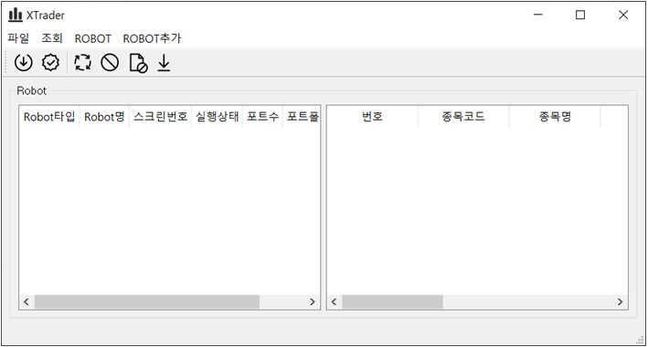

# XTrader
Kiwoom OpenAPI Trader


## 프로젝트명
> XTrader for kiwoom
키움증권 OpenAPI를 이용한 자동매매프로그램   


## 사전 설치
* 키움 open api+ 모듈 [키움증권 openapi 링크](https://www2.kiwoom.com/nkw.templateFrameSet.do?m=m1408000000)

## 개발 환경
* 아나콘다 패키지 설치 기준으로 한 사용자 수동 설치 필요 라이버러리이며 필요 시 설치(필수 아님)
```
pip install gspread # 구글 스프레드시트를 통한 거래 종목 import 및 매매 이력 upload 활용 시
pip install ServiceAccountCredentials 구글 스프레드시트를 통한 거래 종목 import 및 매매 이력 upload 활용 시
pip install telepot # 거래 주요 알람 사용 시
pip install slacker # 거래 주요 알람 사용 시
```

## Reference
* 씽크알고 moneybot님의 mymoneybot for kiwoom [http://www.thinkalgo.co.kr/](http://www.thinkalgo.co.kr/)
